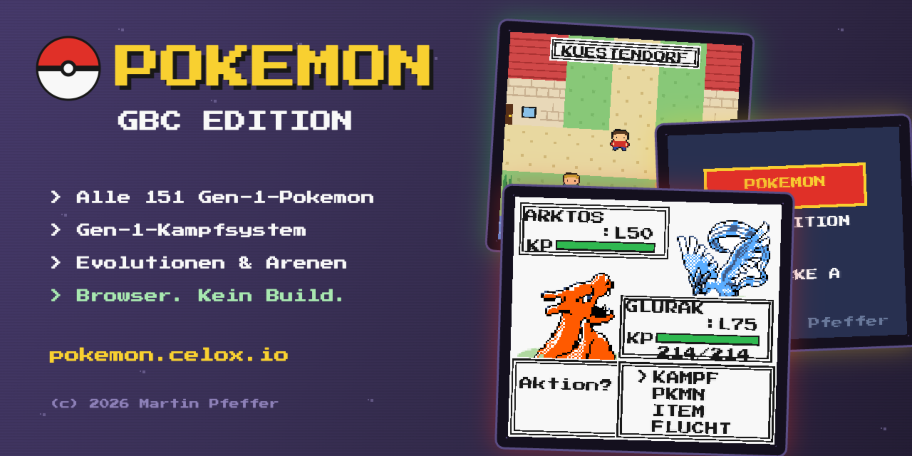
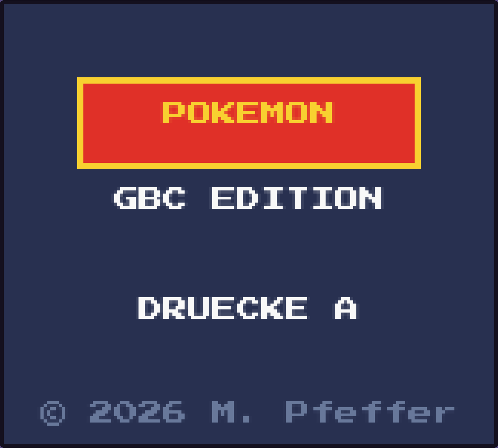
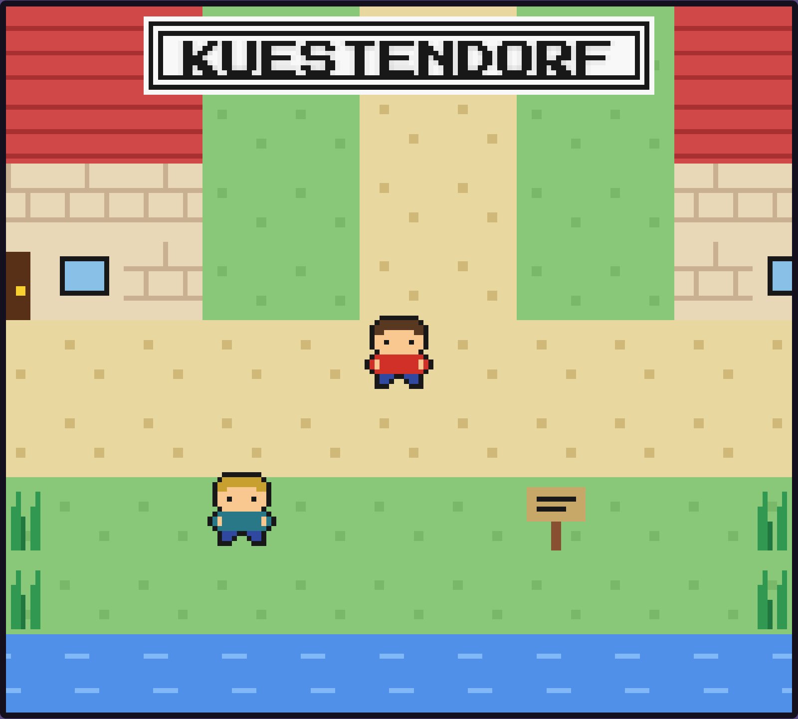
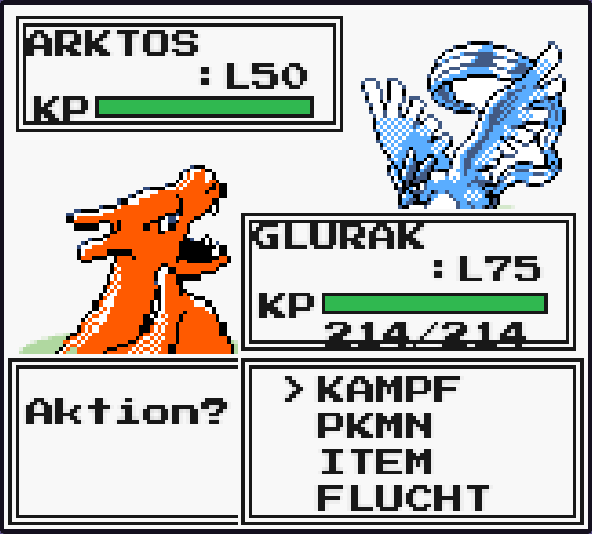

<div align="center">



# Pokémon GBC Edition

**Ein vollständig spielbares Pokémon-Spiel im Game-Boy-Color-Stil — direkt im Browser.**

[](https://pokemon.celox.io)

[](js/)
[](index.html)
[](https://pokeapi.co)
[](#features)
[](#gen-1-mechanik)
[-705898?style=flat-square)](#technik)
[](#schnellstart)
[](#speichern)
[](#steuerung)
[](LICENSE)

</div>

---

## Features

- **Alle 151 Gen-1-Pokémon** — Namen, Typen und Basiswerte originalgetreu von der [PokeAPI](https://pokeapi.co), **fest ins Projekt gebündelt** (`js/pokedex.js` + `assets/sprites/`): das Spiel läuft komplett offline und bleibt auch dann lauffähig, wenn die PokeAPI mal nicht erreichbar ist. Gen-2-Crystal-Sprites für den authentischen GBC-Look.
- **Gen-1-Kampfsystem** — vollständige 15-Typen-Tabelle inkl. aller Quirks (Geist→Psycho = 0, Käfer↔Gift beidseitig 2x), exakte Gen-1-Schadensformel, STAB, Volltreffer, Initiative-Reihenfolge.
- **Evolutionen** — alle Gen-1-Evolutionslinien mit Original-Leveln (Glumanda→Glutexo→Glurak …). Stein-/Tausch-Evolutionen sind auf Level gemappt, Evoli verzweigt zufällig in Aquana/Blitza/Flamara.
- **Attacken-Lernen** — beim Level-Up werden stärkere typgerechte Attacken freigeschaltet.
- **Komplette Spielwelt mit begehbaren Innenräumen** — 2 Dörfer, 2 Städte, 4 Routen, eine Höhle, der Siegesweg, NATURPARK & DRACHENTAL sowie die Story-Region NEBELWALD + SCHATTENVERSTECK — 17 Maps insgesamt: Arenen, Poké-Center, Märkte und dein Zuhause sind echte Innenräume mit Warp-Türen (Overworld: 72×60 Tiles, alles prozedural gezeichnet).
- **Story: TEAM SCHATTEN** — ab STEINSTADT führt ein Waldpfad in den NEBELWALD. Dein Rivale SILAS versperrt den Pfad, zwei Rüpel lauern im Gras, und tief im SCHATTENVERSTECK wartet BOSS NOX. Sein Sturz belohnt dich mit einem **MEISTERBALL** (fängt garantiert).
- **Online-PvP (live)** — Pausenmenü → ONLINE: Lobby im offiziellen GBC-Look mit **Schnellkampf** (ohne Legendäre), privaten **Räumen** (4-stelliger Code) und Code-Beitritt; danach ein synchroner Trainerkampf gegen echte Spieler über `wss://pokemon.celox.io/ws`. Eigenes **PvP-Team** wählbar (Party+Box), **Zug-Timer**, **Reconnect** bei Verbindungsabbruch. Der Server ist **autoritativ** (Node + ws): er berechnet Stats/Schaden/RNG selbst mit der geteilten Engine (`battle-core.js`) — Cheating via manipuliertem Spielstand ist wirkungslos. Architektur & Protokoll: [`MULTIPLAYER_PLAN.md`](MULTIPLAYER_PLAN.md).
- **Replays** — Pausenmenü → ONLINE → REPLAYS: die letzten Ranglisten-Kämpfe ansehen. Der Server speichert nur **Seed + Aktions-Log** (winzig); der Client rechnet den Kampf dank der deterministischen Engine lokal nach und spielt ihn im echten Kampf-Look ab — bitgleich zum Original.
- **Live-Tausch** — Pausenmenü → ONLINE → TAUSCH: mit einem zufälligen Partner ein Pokémon tauschen. Beide bieten an, beide bestätigen, der Server tauscht. **Tausch-Evolutionen** (Kadabra→Simsala, Maschock→Machomei, Georok→Geowaz, Alpollo→Gengar) lösen beim Empfang aus — endlich die klassische „tauschen zum Entwickeln"-Mechanik.
- **Ranglisten-PvP (ELO)** — Schnellkampf zählt für die Wertung: ELO (Start 1000, K=32), Sieg/Niederlage aktualisieren beide Spieler, ELO-Delta direkt am Kampfende. Pausenmenü → ONLINE → RANGLISTE zeigt die Top 10; die eigene Wertung + Rang stehen in der Lobby. Private Räume sind casual (keine Wertung).
- **Cloud-Sync (geräteübergreifend)** — Pausenmenü → CLOUD: Spielstand unter einem anonymen **6-Zeichen-Code** sichern; auf einem zweiten Gerät denselben Code eingeben → Stand übernehmen. Optionaler **Auto-Sync** (jede Minute). SQLite-Backend (`/api/save`), kein Login/PII. `localStorage` bleibt die lokale Wahrheit, die Cloud ist Sync/Backup darüber (Last-Write-Wins).
- **2 echte Arenen** — mit Arena-Trainern im Inneren und Rocko (Gestein) bzw. Misty (Wasser) als Leiter mit schlauer Typ-KI; Orden als Belohnung.
- **Pokémon-Liga als Gauntlet** — Top 4 (Lorelei/Eis, Bruno/Kampf, Agathe/Geist, Siegfried/Drache, L51–56) blockieren nacheinander den Weg zum Champion Blau (6er-Team bis L60). Zutritt nur mit beiden Orden.
- **Statuseffekte** — Gift, Verbrennung, Paralyse, Gefrieren mit Gen-1-Mechanik: 1/16-Rundenschaden, Brand halbiert den phys. Angriff, Paralyse viertelt Initiative + 25 % Ausfall, Feuer taut auf, Typ-Immunitäten.
- **Geld & Märkte** — Trainer zahlen Preisgeld; 3 Markt-Stufen verkaufen Pokéball/Superball/Hyperball, Trank/Supertrank/Hypertrank, Beleber und Heiler. Bälle mit Fangbonus, Status erhöht die Fangchance.
- **Sicht-Trainer** — 31 Trainer entdecken dich klassisch per Sichtlinie („!"), laufen heran und fordern dich heraus (kein Fangen/Fliehen, 1,5x EXP) — darunter Picknicker, Park-Ranger, die Ass-Trainer im DRACHENTAL und TEAM SCHATTEN im NEBELWALD.
- **Neue Gebiete hinter KUESTENDORF** — der Höhleneingang führt über ROUTE 4 in den **NATURPARK** (eigener Heil-Ranger, alle drei EVOLI-Formen wild fangbar) und – erst nach dem Champion-Sieg – ins **DRACHENTAL** mit wilden Drachen und Endgame-Trainern auf Level 42–55.
- **5 Legendäre** — Arktos (Felsgrotte), Zapdos (Route 2), Lavados (Siegesweg), Mewtu (Geheimkammer, erst nach dem Champion-Sieg) und Mew (versteckt hinter der Liga).
- **Fangen, Team & Box** — HP-abhängige Fangchance mit Ball-Wurf-Animation, Team (max. 6), Box, Tauschen.
- **Pokédex** — alle 151 Einträge: gefangen = farbig mit Basiswerten, gesehen = Silhouette, unbekannt = `----`. **Alle 151 sind fangbar** (Zonen-Encounter + Evolutionen + Legendäre, seltene Wild-Starter, alle drei EVOLI-Formen wild im NATURPARK).
- **Beutel** — Items im Kampf und in der Overworld nutzbar (heilen, wiederbeleben, Status kurieren); Heilung & Status-Kur kostenlos in jedem Poké-Center (setzt den Respawn-Punkt).
- **Sound** — GBC-artige WebAudio-Bleeps (Treffer, Level-Up, Fang, Orden-Fanfare …), stumm schaltbar mit `M`.

<div align="center">

| Titel | Overworld | Kampf |
|:---:|:---:|:---:|
|  |  |  |

</div>

## Schnellstart

**Online spielen:** [pokemon.celox.io](https://pokemon.celox.io)

**Lokal:** `index.html` doppelklicken — fertig. Oder mit einem statischen Server:

```bash
python3 -m http.server 8000
# http://localhost:8000
```

Pokédex-Daten und Sprites sind ins Projekt gebündelt — **kein Internet nötig** (auch nicht beim ersten Start). Lediglich die Pixel-Font wird von Google Fonts geladen, fällt aber automatisch auf eine Monospace-Schrift zurück, wenn sie nicht erreichbar ist.

### Pokédex-Bundle neu erzeugen

`js/pokedex.js` (Daten) und `assets/sprites/*.png` werden offline ausgeliefert. Zum Neu-Generieren von der PokeAPI:

```bash
node tools/fetch-pokedex.js   # Node 18+; lädt 151 Einträge + 302 Sprites
```

## Steuerung

| Aktion | Desktop | Mobile |
|---|---|---|
| Laufen | Pfeiltasten / WASD | D-Pad |
| Bestätigen / Reden / Menü | `Z` / `Enter` | `A` |
| Abbrechen / Zurück | `X` / `Esc` | `B` |
| Sound an/aus | `M` | — |

Auf Touch-Geräten erscheinen D-Pad und A/B-Buttons automatisch (Pointer-Events, kein 300-ms-Delay, kein Scroll/Zoom).

## Spielverlauf

```
KIEFERNDORF (Start + Starterwahl, MAMA heilt zu Hause)
   │  Route 1 (L2-6)
WALDDORF (Markt) ── Route 2 (L10-15) ── FELSGROTTE (L14-19) ⛰ Arktos
   ┌──────────────────────────────────┘
STEINSTADT (Center + Markt) 🥇 Arena 1: ROCKO (Gestein, 2 Arena-Trainer)
   │  Waldpfad (Nord) → NEBELWALD (L18-24) 👤 Rivale SILAS
   │       └─ SCHATTENVERSTECK 🕶 BOSS NOX → MEISTERBALL
   │  Route 3 (L17-23)
KUESTENDORF (Center + Markt) 🥈 Arena 2: MISTY (Wasser) 🌊 Lapras am Strand
   │  Tor: nur mit 2 ORDEN          └─ Höhle (Osten) → ROUTE 4 (L20-26)
   │                                      └─ NATURPARK (L16-26, Ranger heilt, alle EVOLI-Formen)
SIEGESWEG (L28-38) ── POKEMON-LIGA:              └─ DRACHENTAL (L42-55, nur als CHAMPION)
   TOP 4  LORELEI → BRUNO → AGATHE → SIEGFRIED  👑 CHAMP BLAU
   └─ danach: MEWTU in der Geheimkammer der Felsgrotte
```

Wer beim Kampf verliert, erwacht geheilt am zuletzt besuchten Heilpunkt.

## Speichern

Ja — **alles liegt in `localStorage`**:

- `pkmn_save_v1` — Spielstand: Team & Box (Spezies/Level/EXP/KP/Status), Beutel, Geld, Orden, Trainer-/Arena-/Top-4-/Champion-/Legendären-Flags, aktuelle Map + Position, Respawn-Punkt, Pokédex (gesehen/gefangen). **Stilles Auto-Save jede Minute** (ohne Hinweis) + **Auto-Save nach jedem Kampf** + manuell über Menü → SPEICHERN. Ältere Spielstände werden automatisch migriert.
- `pkmn_data_v1` — Pokédex-Datencache (nur noch Fallback; Standard ist das gebündelte `js/pokedex.js`).

## Technik

| Datei | Inhalt |
|---|---|
| `js/data.js` | Datenbereitstellung (gebündeltes `pokedex.js` → localStorage-Cache → PokeAPI-Fallback), deutsche Namen, Move-Pools (Lern-Level + Status-Nebeneffekte), Item-Katalog, Sprite-Cache mit Flood-Fill-Transparenz |
| `js/pokedex.js` | **Auto-generiert** (`tools/fetch-pokedex.js`): `window.POKEDEX` mit allen 151 Einträgen + lokalen Sprite-Pfaden — macht das Spiel offline-fähig |
| `js/battle.js` | Typen-Tabelle, Schadensformel, Stats/EXP, Statuseffekte, Evolutionstabelle, Fangen (3 Ball-Stufen), Preisgeld, smarte Leiter-KI, kompletter Kampfbildschirm (wild + Trainer) |
| `js/world.js` | Multi-Map-System (Overworld 72×60 + 11 Interiors per ASCII-Layout), Warps, Zonen-Encounter, Sicht-Trainer, Arenen, Liga-Gauntlet, Tore, Legendäre, prozedurale Tiles & Charsets |
| `js/ui.js` | Textbox/Menü-Helfer, Titel, Starterwahl, Pausenmenü, Team, Beutel, Markt, Box, Pokédex, Online-Lobby (Schnellkampf/Raum/Code) |
| `js/net.js` | Online-Transport: WebSocket-Client (Trainer-ID, Matchmaking, Raum-Codes) + Mock-Fallback |
| `server/` | Node-Service: autoritativer PvP-WebSocket-Server (Matchmaking, Räume, Team-Validierung, Turn-Loop, Reconnect) **+ Cloud-Sync HTTP-API** (`sync.js`, SQLite via better-sqlite3). Nutzt `battle-core.js` + `species.json`. Deploy: systemd `pkmn-battle` + nginx-`/ws`- & `/api/`-Proxy |
| `js/battle-core.js` | **Isomorphe** Gen-1-Kampflogik (Typentabelle, Stats, EXP, Schaden, Fangen, Evolutionen) mit **seedbarer RNG** — eine Quelle der Wahrheit für Solo & den künftigen PvP-Server (Browser-Global + Node-`require`) |
| `js/sound.js` | GBC-artige WebAudio-SFX (Square/Triangle-Bleeps), Mute-Toggle |
| `js/main.js` | Game-Loop, Screen-Stack, Eingaben (Tastatur + Touch), Speichern/Laden mit Migration, pixel-perfekte Skalierung |

Nativ **160×144 px** (GBC), ganzzahlig hochskaliert mit `image-rendering: pixelated`. Kein Framework, kein Build-Schritt, keine Laufzeit-Abhängigkeiten — Daten und Sprites sind gebündelt, die Pixel-Font ist optional (Monospace-Fallback).

Der Kampfablauf ist als **async-Koroutine** implementiert: `await say(…)` / `await choose(…)` warten über ein pro Frame aufgelöstes Promise (`Game.nextFrame()`) auf den Game-Loop — der Kampf liest sich dadurch wie ein lineares Skript.

## Gen-1-Mechanik

Schadensformel exakt nach Spezifikation:

```
dmg = floor(floor(floor((2·Level/5 + 2) · Power · Atk/Def) / 50) + 2)
      · STAB(1.5) · Typ-Effektivität · Zufall(0.85…1.0)
```

Stats nach Gen-1-Formel mit festen IVs (8), EXP-Kurve „Medium Fast" (Level³), EXP-Gewinn `baseExp · Level / 7` (Trainer: ×1,5).

**Bewusste Abkürzungen** (im Code kommentiert, für spätere Erweiterung):

- Kein PP-System, keine Status-Attacken/-Effekte
- Vereinfachte Fangformel (ohne speziesabhängige Catch-Rate)
- Volltreffer als simple 2x-Chance statt Gen-1-Crit-Stages
- Stein-/Tausch-Evolutionen als Level-Evolutionen; Evoli-Zweig zufällig
- Fix-Schaden-Attacken (Drachenwut, Nachtnebel) als normale Power-Moves

## Deployment

```bash
rsync -avz --delete --exclude='.DS_Store' ./ root@<server>:/var/www/pokemon.celox.io/
```

Statisches Hosting genügt (Nginx/Apache/GitHub Pages) — es gibt kein Backend.

## Lizenz

[MIT](LICENSE) — © 2026 [Martin Pfeffer](https://celox.io)

Pokémon und alle zugehörigen Namen sind Marken von Nintendo/Game Freak/Creatures Inc. Dieses Projekt ist ein nicht-kommerzielles Fan-/Lernprojekt ohne jegliche Verbindung zu den Rechteinhabern. Spieldaten via [PokeAPI](https://pokeapi.co).
